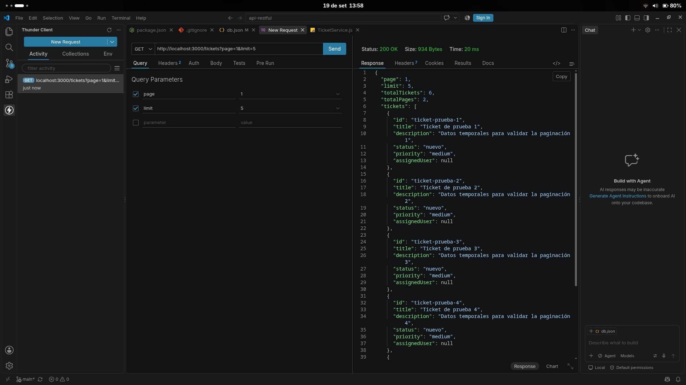
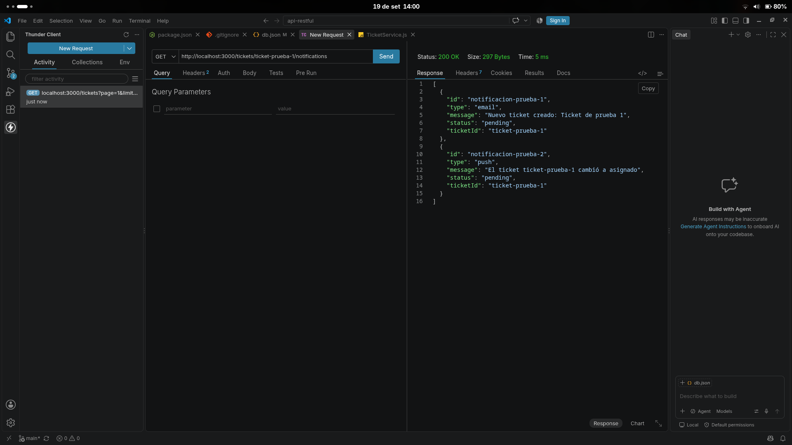
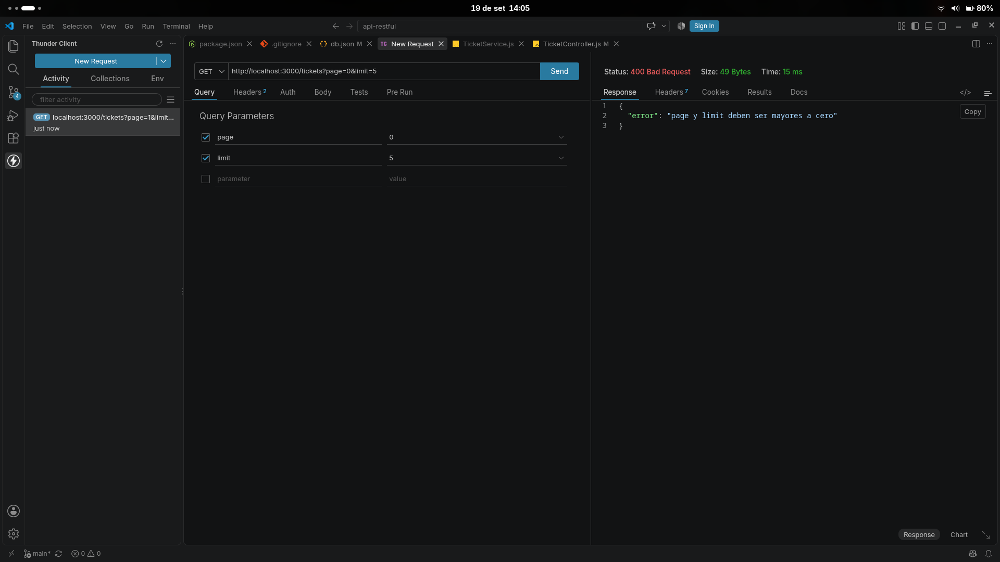

# API RESTful de Tickets

API desarrollada con Express y CommonJS para gestionar tickets y sus notificaciones.

## Requisitos

- Node.js instalado.
- Dependencias instaladas con `npm install`.
- Archivo `.env` configurado si se desea probar el envío de correos.

No es necesario modificar `.env` para probar los endpoints de consulta.

## Iniciar el servidor

Desde la carpeta del proyecto:

```bash
npm run dev
```

La consola debe mostrar un resultado similar a:

```text
[nodemon] starting `node app.js`
Servidor ejecutándose en http://localhost:3000
```

Mantén esta terminal abierta y ejecuta las pruebas desde una segunda terminal o desde Postman.

El servidor escucha en `127.0.0.1:3000`, por lo que puedes usar `http://localhost:3000` o `http://127.0.0.1:3000`.

### Si el puerto 3000 está ocupado

Si aparece `EADDRINUSE`, identifica y cierra el proceso anterior:

```bash
lsof -i :3000
kill <PID>
npm run dev
```

También puedes cerrar la terminal anterior donde quedó ejecutándose `nodemon`.

## Pruebas de la API

### 1. Crear un ticket

```bash
curl -i -X POST http://localhost:3000/tickets \
  -H "Content-Type: application/json" \
  -d '{
    "title": "Error en el inicio de sesión",
    "description": "El usuario no puede ingresar al sistema",
    "priority": "high"
  }'
```

La respuesta debe ser `201 Created`. Copia el valor de `id` para usarlo en las siguientes solicitudes.

### 2. Listar tickets con paginación

```bash
curl -i "http://localhost:3000/tickets?page=1&limit=5"
```

Debe responder `200 OK` y mostrar `page`, `limit`, `totalTickets`, `totalPages` y `tickets`.

### 3. Asignar un ticket

```bash
curl -i -X PUT "http://localhost:3000/tickets/<ID_DEL_TICKET>/assign" \
  -H "Content-Type: application/json" \
  -d '{"user":"Ana Pérez"}'
```

### 4. Cambiar el estado de un ticket

```bash
curl -i -X PUT "http://localhost:3000/tickets/<ID_DEL_TICKET>/status" \
  -H "Content-Type: application/json" \
  -d '{"status":"en progreso"}'
```

### 5. Listar todas las notificaciones

```bash
curl -i http://localhost:3000/notifications
```

### 6. Consultar el historial de un ticket

```bash
curl -i "http://localhost:3000/tickets/<ID_DEL_TICKET>/notifications"
```

Debe responder `200 OK` con las notificaciones cuyo `ticketId` corresponde al ticket solicitado.

### 7. Eliminar un ticket

```bash
curl -i -X DELETE "http://localhost:3000/tickets/<ID_DEL_TICKET>"
```

Debe responder `200 OK` con el mensaje `Ticket eliminado correctamente`.

## Evidencias de las tareas

### 1. Paginación de tickets

La consulta `GET /tickets?page=1&limit=5` devuelve los tickets paginados y los metadatos `page`, `limit`, `totalTickets` y `totalPages`.



### 2. Historial de notificaciones por ticket

La consulta `GET /tickets/:id/notifications` devuelve únicamente las notificaciones asociadas al ticket solicitado.



### 3. Manejo global de errores

La consulta `GET /tickets?page=0&limit=5` genera una respuesta `400 Bad Request`, procesada mediante el middleware global `errorHandler`.



## Verificación de la solución implementada

El historial de notificaciones sigue el flujo:

```text
GET /tickets/:id/notifications
        -> TicketController.notifications
        -> TicketService.getNotifications(id)
        -> NotificationService.listByTicket(ticketId)
```

Además, `app.js` registra `errorHandler` después de las rutas para procesar los errores de la API.

## Restaurar la base de datos de prueba

Al finalizar las pruebas, `database/db.json` debe quedar limpio:

```json
{
  "tickets": [],
  "notifications": []
}
```

Las pruebas no requieren realizar commits ni modificar credenciales.